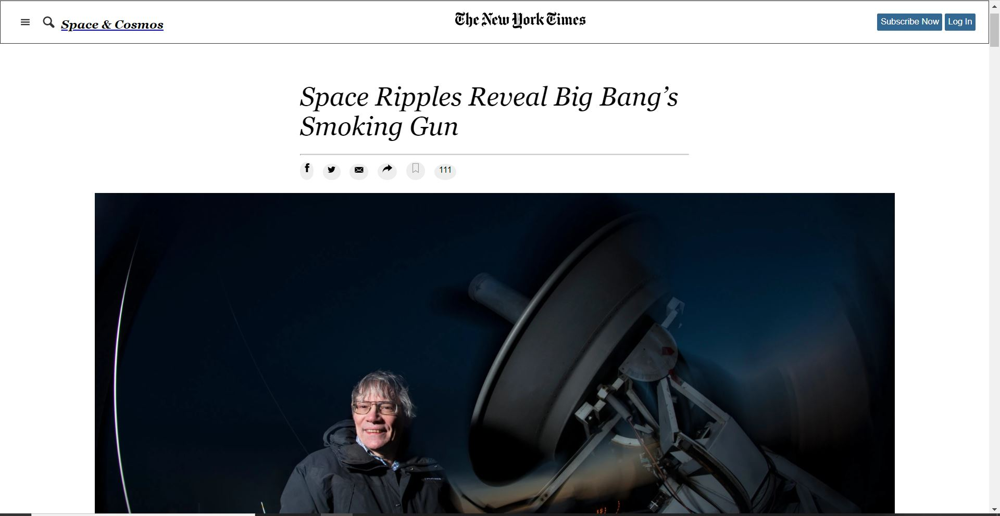

## New York Times Clone

A New York Times clone, used for training purposes

This is a project for the Microverse training program, Week 1, and it aims to simulate the HTML and CSS parts of a [New York Times page](https://www.nytimes.com/2014/03/18/science/space/detection-of-waves-in-space-buttresses-landmark-theory-of-big-bang.html?_r=0).

## Built With

HTML
CSS

## Live Demo

[Try a lıve demo](https://nytimecloneforprojectone.netlify.app/)

## Authors 👤

### Mert Gunduz

_[Github](https://github.com/mgunduz1)
_[LinkedIn](https://www.linkedin.com/in/mert-gunduz-875280202/)

### Ayman Jabr

_[Github](https://github.com/AymanJabr/)
_[LinkedIn](https://www.linkedin.com/in/ayman-jabr-3705a4100/)

## Show your support ⭐️⭐️

Give a star if you like this project!

## License 📝

This project is [MIT](https://www.mit.edu/~amini/LICENSE.md) licensed.

# html-linters
